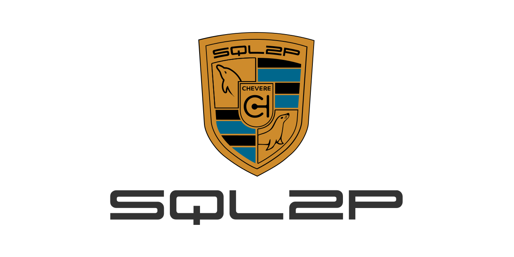

# SQL2P

> 🔔 Subscribe to the [newsletter](https://chv.to/chevere-newsletter) to don't miss any update regarding Chevere.


[](https://github.com/chevere/sql2p/actions)

[](LICENSE)
[](https://phpstan.org/)
[](https://dashboard.stryker-mutator.io/reports/github.com/chevere/sql2p/1.0)

[](https://sonarcloud.io/dashboard?id=chevere_sql2p)
[](https://sonarcloud.io/dashboard?id=chevere_sql2p)
[](https://sonarcloud.io/dashboard?id=chevere_sql2p)
[](https://sonarcloud.io/dashboard?id=chevere_sql2p)
[](https://sonarcloud.io/dashboard?id=chevere_sql2p)
[](https://sonarcloud.io/dashboard?id=chevere_sql2p)
[](https://www.codefactor.io/repository/github/chevere/sql2p)



## Summary

SQL2P generates [Parameter(s)](https://chevere.org/packages/parameter) for MySQL schemas. It represents database tables and its columns using the Parameter package.

## Installing

SQL2P is available through [Packagist](https://packagist.org/packages/chevere/sql2p) and the repository source is at [chevere/sql2p](https://github.com/chevere/sql2p).

```sh
composer require chevere/sql2p
```

## What it does?

From a `CREATE TABLE` statement like this one below.

```sql
CREATE TABLE `invoice` (
  `id` INT UNSIGNED NOT NULL AUTO_INCREMENT,
  `client_id` INT UNSIGNED NOT NULL,
  `datetime` DATETIME NOT NULL DEFAULT CURRENT_TIMESTAMP,
  `details` LONGTEXT NULL,
  `quantity` INT UNSIGNED NOT NULL,
  `rate` DECIMAL(10,2) NOT NULL,
  `total` DECIMAL(19,4) GENERATED ALWAYS AS (quantity*rate),
  PRIMARY KEY (`id`)
) ENGINE = InnoDB;
```

SQL2P generates the following PHP code.

```php
use Chevere\Parameter\Interfaces\ArrayParameterInterface;
use function Chevere\Parameter\arrayp;
use function Chevere\Parameter\datetime;
use function Chevere\Parameter\float;
use function Chevere\Parameter\int;
use function Chevere\Parameter\null;
use function Chevere\Parameter\string;
use function Chevere\Parameter\union;

function invoiceTable(): ArrayParameterInterface
{
    return arrayp(
        id: int(min: 0),
        client_id: int(min: 0),
        datetime: datetime(),
        details: union(
            null(),
            string()
        ),
        quantity: int(min: 0),
        rate: float(),
        total: float()
    );
}
```

The `invoiceTable()` function returns table `invoice` schema in PHP code using [Array](https://chevere.org/packages/parameter#array) Parameter where each column is represented by another Parameter.

From this you can add your own validation rules on top of generated code.

For example, you limit `quantity` to a range of `100, 200` by adding `max` and `min` arguments. Add a regex to `details` to validate string shape.

```diff
details: union(
    null(),
-    string()
+    string('/^(?!\s*$)./')
),
-quantity: int(min: 0),
+quantity: int(max: 200, min: 100),
```

Array Parameter object returned by this function can be also used to dynamic interact with one or more of these columns. See [Array Composing](#array-composing) to learn more.

## Creating SQL2P

Create a `SQL2P` instance by passing the SQL and a [Writer](https://chevere.org/packages/writer) instance. On instance creation the SQL is parsed and the writer is used to write the generated code.

```php
use Chevere\SQL2P\SQL2P;
use Chevere\Writer\StreamWriter;
use function Chevere\Filesystem\fileForPath;
use function Chevere\Writer\streamFor;

$schema = __DIR__ . '/schema.sql';
$output = __DIR__ . '/sql2p.php';
$header = <<<PHP
namespace MyNamespace;
PHP;
$sql = file_get_contents($schema);
file_put_contents($output, '');
$stream = streamFor($output, 'w');
$writer = new StreamWriter($stream);
$sql2p = new SQL2P($sql, $writer, $header);
$count = count($sql2p);
echo <<<PLAIN
[{$count} tables] {$output->path()}

PLAIN;
```

## Data validation

Use SQL2P to validate data against table Parameter schema.

For example, on a single fetch result you may get the following array for a database row.

```sql
SELECT * FROM invoice WHERE id = 1
```

```php
$fetch = [
    'id' => 1,
    'client_id' => 1234,
    'datetime' => '2023-10-22 19:58:44',
    'details' => null,
    'quantity' => 100,
    'rate' => 16.5,
    'total' => 1650,
];
```

Function `invoiceTable()` can be used to validate `$fetch` by invoking it.

```php
$table = invoiceTable();
$table($fetch); // validation
```

Use `arrayFrom` function to create an array taking only the columns you need.

```sql
SELECT id, total FROM invoice WHERE id = 1
```

```php
use function Chevere\Parameter\arrayFrom;

$fetch = [
    'id' => 1,
    'total' => 1650,
];
$table = arrayFrom(invoiceTable(), 'id', 'total');
$table($fetch);
```

Use `arguments` function to get typed access to fetched array members.

```php
use function Chevere\Parameter\arguments;

$invoice = arguments($table, $fetch);
$total = $invoice->required('total')->int(); // 1650
```

When fetching multiple rows wrap Array table with [iterable](https://chevere.org/packages/parameter.html#iterable) function.

```sql
SELECT id, total FROM invoice WHERE id > 0
```

```php
$fetchAll = [
    0 => [
        'id' => 1,
        'total' => 1650,
    ],
    1 => [
        'id' => 2,
        'total' => 1820,
    ],
];
$iterable = iterable($table);
$iterable($fetchAll);
```

Note that `arguments` function supports iterable.

```php
$invoices = arguments($iterable, $fetchAll);
$secondRow = $invoices->required('1')->array();
```

## Array composing

Parameter provides a set of tools to work with arrays, enabling to dynamically add, remove or modify values. It also enables to compose arrays from other arrays.

For example to add a `total_usd` virtual column to `invoiceTable()`.

```sql
SELECT
    id,
    total,
    total/100 total_usd
FROM invoice WHERE id = 1
```

```php
$fetch = [
    'id' => 1,
    'total' => 1650,
    'total_usd' => 16.5,
];
$table = arrayFrom(invoiceTable(), 'id', 'total');
$table = $table
    ->withRequired(
        total_usd: float(),
    );
$table($fetch);
```

When `JOIN` tables you may want to take columns based on joined tables. Use `takeFrom` function to create a iterable with `column => parameter` pairs.

```sql
SELECT
    invoice.id,
    invoice.total,
    client.name,
    client.email
FROM invoice
JOIN client ON client.id = invoice.client_id
WHERE invoice.id = 1
```

```php
$fetch = [
    'id' => 1,
    'total' => 1650,
    'name' => 'Rodolfo',
    'email' => 'rodolfo@chevere.org'
];
$invoice = arrayFrom(invoiceTable(), 'id', 'total');
$client = takeFrom(clientTable(), 'name', 'email');
$table = $invoice->withRequired(...$client);
$table($fetch);
```

For this code `$client` is assigned to an iterable containing `name` and `email` column pairs from `clientTable()`. Then by calling `withRequired` on `$invoice` it gets these columns on spread.

## Documentation

Documentation is available at [chevere.org](https://chevere.org/packages/sql2p).

## License

Copyright [Rodolfo Berrios A.](https://rodolfoberrios.com/)

Chevere is licensed under the Apache License, Version 2.0. See [LICENSE](LICENSE) for the full license text.

Unless required by applicable law or agreed to in writing, software distributed under the License is distributed on an "AS IS" BASIS, WITHOUT WARRANTIES OR CONDITIONS OF ANY KIND, either express or implied. See the License for the specific language governing permissions and limitations under the License.
